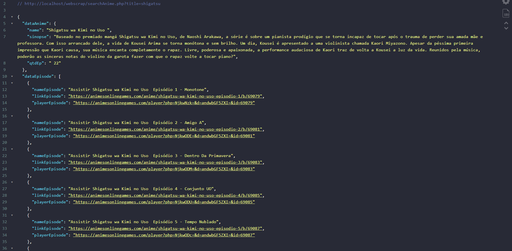

# WebScraping
- Estudando conceito de web scraping com PHP pegando informações do site de anime https://animesonlinegames.com/
- Projeto criado apenas para ver web scraping na prática, projeto não está 100% funcional

# Funcionamento
- Busca o nome do anime desejado
- Pega o primeiro item encontrado
- Retorna dados básicos como nome, número de episódios e sinopse
- Retorna dados dos episódios como nome, link e o link do player dos 5 primeiros episódios ( Limitei para essa quantidade por conta de excesso de requests )

--- 

## Exemplo de Resposta
- Nomes de Exemplo: shigatus, boruto, kimetsu

---
## Contribuidores

- Raphael Satomi Gomes de Andrade <raphaelsatomi@gmail.com>